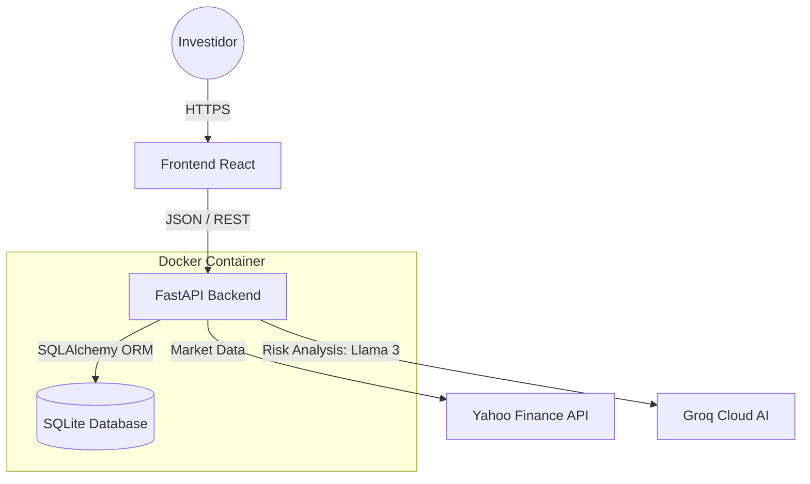

# 🚀 FinSight API — Intelligent Investment Backend

---

## 📌 Visão Geral

O **FinSight API** é o **serviço backend** de um sistema inteligente de gestão de investimentos.  
Trata-se de uma **API RESTful de alta performance**, desenvolvida com **FastAPI**, responsável por:

- Gerenciar portfólios de investimentos
- Consolidar posições de ativos (compra e venda)
- Obter dados de mercado em tempo real
- Gerar **análises inteligentes de risco financeiro** utilizando **IA Generativa**

Este projeto foi desenvolvido como um **MVP acadêmico**, com foco em **arquitetura de software, regras de negócio e integração com serviços externos**.

---

## 🧠 Arquitetura da Solução

O sistema segue princípios de **Clean Architecture** e **separação de responsabilidades**, mantendo o backend totalmente desacoplado da interface de usuário.

### 📐 Diagrama de Containers (C4 Model)

---

## 🔄 Fluxo Inteligente de Dados

### 📊 Market Service
Consulta o **Yahoo Finance** via `yfinance` para obter o preço atual dos ativos presentes na carteira do usuário.

### 📐 Portfolio Calculation
Consolida automaticamente:
- Quantidades por ativo  
- Exposição percentual  
- Valor total da carteira  

Esses cálculos são feitos no backend, garantindo consistência e segurança.

### 🧠 AI Advisor
Os dados consolidados da carteira são enviados para a **Groq Cloud**, utilizando o modelo **Llama 3.3**, que retorna uma análise textual:
- Humana  
- Direta  
- Levemente sarcástica  
- Focada em risco e diversificação  

---

## ✨ Funcionalidades Principais

### 📁 Gestão de Portfólios
- CRUD completo de carteiras  
- Cálculo automático do valor total da carteira  

### 💱 Transações de Ativos

#### 🟢 Compra
- Consolidação automática de posições  
- Atualização de quantidade e preço médio  

#### 🔴 Venda
- Validação de saldo disponível  
- Remoção automática de ativos com quantidade zerada  

### 📈 Market Data
- Integração em tempo real via **yfinance**  
- Cache interno para evitar chamadas excessivas à API externa  

### 🧠 Análise Inteligente
- Endpoint dedicado para análise de risco  
- Avaliação da diversificação da carteira via **LLM (Llama 3.3)**  

---

## 🛠️ Tech Stack

- **Linguagem:** Python 3.11  
- **Framework Web:** FastAPI  
- **ORM:** SQLAlchemy  
- **Validação:** Pydantic v2  
- **Banco de Dados:** SQLite  
- **Market Data:** yfinance  
- **IA Generativa:** Groq SDK (Llama-3.3-70b-versatile)  

---
