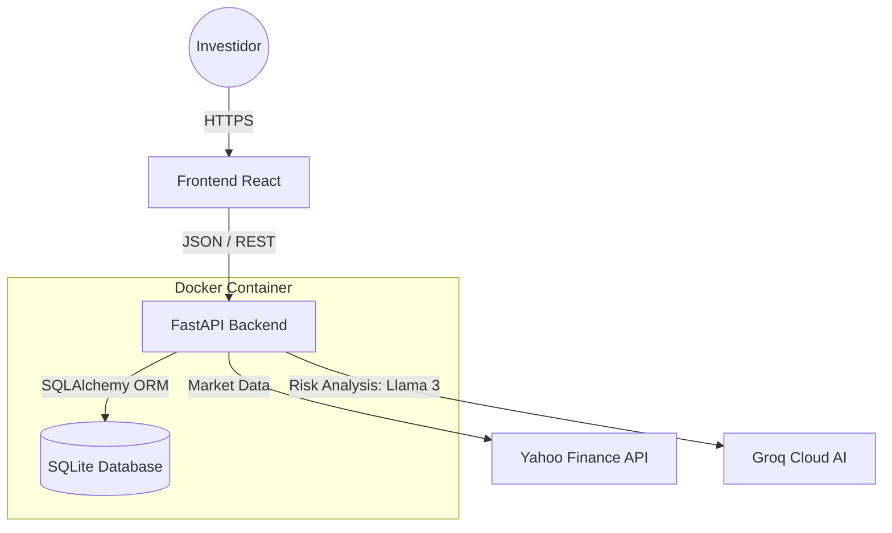

# 🚀 FinSight API — Back-end de Investimento Inteligente


---

## 📌 Visão Geral

O **FinSight API** é o **serviço backend** de um sistema inteligente de gestão de investimentos.  
Trata-se de uma **API RESTful de alta performance**, desenvolvida com **FastAPI**, responsável por:

- Gerenciar portfólios de investimentos
- Consolidar posições de ativos (compra e venda)
- Obter dados de mercado em tempo real
- Gerar **análises inteligentes de risco financeiro** utilizando **IA Generativa**

Este projeto foi desenvolvido como um **MVP acadêmico**, com foco em **arquitetura de software, regras de negócio e integração com serviços externos**.

---

## 🧠 Arquitetura da Solução

O sistema segue princípios de **Clean Architecture** e **separação de responsabilidades**, mantendo o backend totalmente desacoplado da interface de usuário.

### 📐 Diagrama de Containers (C4 Model)


---

## 🔄 Fluxo Inteligente de Dados

### 📊 Market Service
Consulta o **Yahoo Finance** via `yfinance` para obter o preço atual dos ativos presentes na carteira do usuário.

### 📐 Portfolio Calculation
Consolida automaticamente:
- Quantidades por ativo  
- Valor total da carteira  

Esses cálculos são feitos no backend, garantindo consistência e segurança.

### 🧠 AI Advisor
Os dados consolidados da carteira são enviados para a **Groq Cloud**, utilizando o modelo **Llama 3.3**, que retorna uma análise textual:
- Humana  
- Direta  
- Levemente sarcástica  
- Focada em risco e diversificação  

---

## ✨ Funcionalidades Principais

### 📁 Gestão de Portfólios
- CRUD completo de carteiras  
- Cálculo automático do valor total da carteira  

### 💱 Transações de Ativos

#### 🟢 Compra
- Consolidação automática de posições  
- Atualização de quantidade e preço médio  

#### 🔴 Venda
- Validação de saldo disponível  
- Remoção automática de ativos com quantidade zerada  

### 📈 Market Data
- Integração em tempo real via **yfinance**  
- Cache interno para evitar chamadas excessivas à API externa  

### 🧠 Análise Inteligente
- Endpoint dedicado para análise de risco  
- Avaliação da diversificação da carteira via **LLM (Llama 3.3)**

---

## 🌐 Integração com APIs Externas

Conforme requisitos do MVP, detalhamos abaixo o uso de serviços externos:

### 1. Yahoo Finance (via biblioteca `yfinance`)
* **Propósito:** Obtenção de cotações de ativos em tempo real.
* **Licença/Custo:** Uso gratuito via biblioteca pública (Open Source). Não requer chave de API para o volume de requisições deste MVP.
* **Rotas/Dados Utilizados:**
    * `Ticker.history(period="1d")`: Para capturar o preço de fechamento mais recente.
    * `Ticker.info`: Para validar a existência do símbolo do ativo.

### 2. Groq Cloud AI
* **Propósito:** Geração de análise de risco e consultoria financeira.
* **Modelo:** `llama-3.3-70b-versatile` (LLM da Meta).
* **Autenticação:** Requer API Key (Configurada internamente para avaliação).
* **Rota Utilizada:**
    * `client.chat.completions.create`: Envio do JSON da carteira e recebimento da análise textual.
 
---

## 🛠️ Tech Stack

- **Linguagem:** Python 3.11  
- **Framework Web:** FastAPI  
- **ORM:** SQLAlchemy  
- **Validação:** Pydantic v2  
- **Banco de Dados:** SQLite  
- **Market Data:** yfinance  
- **IA Generativa:** Groq SDK (Llama-3.3-70b-versatile)  

---

## 📂 Estrutura do Projeto

A organização de pastas segue o padrão de separação de responsabilidades:

```text
/app
├── /routers      # Endpoints da API (Controllers)
│   ├── assets.py
│   ├── market.py
│   └── portfolios.py
├── /services     # Regras de Negócio e Integrações Externas
│   ├── advisor.py      <-- Lógica da IA (Groq)
│   └── market_service.py <-- Integração Yahoo Finance
├── /models       # Modelos de Banco de Dados (SQLAlchemy)
├── schemas.py    # Modelos de Validação/Resposta (Pydantic)
├── database.py   # Configuração da Sessão do Banco
└── main.py       # Ponto de entrada da aplicação
```

---

## 🚀 Como Rodar o Projeto

Você pode rodar a aplicação de duas formas: via **Docker** (Recomendado para isolamento) ou **Localmente**.

### Opção A: Via Docker (Recomendado)

Garanta que você tem o Docker instalado. Esta opção garante que o ambiente seja idêntico ao de desenvolvimento.

1.  **Construir a Imagem:**
    ```bash
    docker build -t finsight-backend .
    ```

2.  **Rodar o Container:**
    ```bash
    docker run --name finsight-backend-container -p 8000:8000 finsight-backend
    ```

A API estará disponível em: `http://localhost:8000`

### Opção B: Rodar Localmente (Python)

Caso prefira rodar diretamente no Python:

1.  **Instalar Dependências:**
    ```bash
    pip install -r requirements.txt
    ```

2.  **Executar o Servidor:**
    ```bash
    uvicorn app.main:app --host 0.0.0.0 --port 8000 --reload
    ```

---

## 📖 Documentação da API (Swagger UI)

O FastAPI gera documentação automática e interativa. Após rodar o projeto, acesse:

👉 **[http://localhost:8000/docs](http://localhost:8000/docs)**

Lá você poderá testar todos os endpoints (GET, POST, PUT, DELETE) diretamente pelo navegador.

